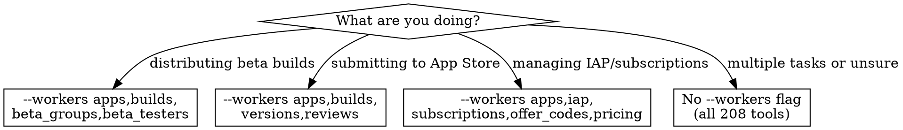

# App Store Connect MCP Integration

**Core principle**: When asc-mcp is configured, you can manage the entire App Store Connect workflow without leaving Claude Code — submit builds, distribute to TestFlight, respond to reviews, and monitor metrics programmatically.

## Setup

### Install

```bash
brew install mint
mint install zelentsov-dev/asc-mcp@1.4.0
```

### Create API Key

1. Open [App Store Connect → Users and Access → Integrations → API](https://appstoreconnect.apple.com/access/integrations/api)
2. Generate key with **Admin** or **App Manager** role
3. Download the `.p8` file (one-time download — save it securely)
4. Note the **Key ID** and **Issuer ID**

### Add to Claude Code

```bash
claude mcp add asc-mcp \
  -e ASC_KEY_ID=YOUR_KEY_ID \
  -e ASC_ISSUER_ID=YOUR_ISSUER_ID \
  -e ASC_PRIVATE_KEY_PATH=/path/to/AuthKey.p8 \
  -- ~/.mint/bin/asc-mcp
```

### Verify

Ask Claude to call `company_current`. If it returns your team name, you're connected.

---

## Worker Filtering

asc-mcp has 25 workers (~208 tools). Loading all of them wastes context. Use `--workers` to load only what you need.

### Presets

| Preset | Workers | Tools | Use Case |
|--------|---------|-------|----------|
| **TestFlight** | `apps,builds,beta_groups,beta_testers` | ~34 | Beta distribution |
| **Release** | `apps,builds,versions,reviews` | ~40 | App Store submission |
| **Monetization** | `apps,iap,subscriptions,offer_codes,pricing` | ~55 | IAP and subscriptions |
| **Full** | (default, all workers) | ~208 | Everything |

To use a preset, add `--workers` when registering the server:

```bash
claude mcp add asc-mcp \
  -e ASC_KEY_ID=... \
  -e ASC_ISSUER_ID=... \
  -e ASC_PRIVATE_KEY_PATH=... \
  -- ~/.mint/bin/asc-mcp --workers apps,builds,versions,reviews
```

**Note**: `company` and `auth` workers always load regardless of `--workers`. When `builds` is enabled, `build_processing` and `build_beta` are included automatically.

### Worker Selection Decision Tree



---

## Workflow: Release Pipeline

Submit a new version to the App Store.

```
1. apps_search(query: "MyApp")           → get app ID
2. builds_list(appId, limit: 5)          → find latest processed build
3. app_versions_create(appId, platform: "IOS", versionString: "2.1.0")
4. app_versions_attach_build(versionId, buildId)
5. app_versions_set_review_details(versionId, { contactEmail, notes, ... })
6. app_versions_submit_for_review(versionId)
7. (After approval) app_versions_create_phased_release(versionId)
```

**Before step 3**: Version string must not already exist. Check with `app_versions_list`.

**Before step 4**: Build must be in `VALID` processing state. Check with `builds_get_processing_state`.

**Before step 6**: Version must be in `PREPARE_FOR_SUBMISSION` state. Attaching a build and setting review details are prerequisites.

---

## Workflow: TestFlight Distribution

Distribute a build to beta testers.

```
1. apps_search(query: "MyApp")           → get app ID
2. builds_list(appId, limit: 5)          → find latest build
3. builds_set_beta_localization(buildId, locale: "en-US", whatsNew: "Bug fixes")
4. beta_groups_list(appId)               → find or create group
   OR beta_groups_create(appId, name: "Internal Testers", isInternal: true)
5. beta_groups_add_builds(groupId, [buildId])
6. builds_send_beta_notification(buildId) → notify testers (optional)
```

**Tip**: Internal testers (up to 100) get builds immediately. External testers (up to 10,000) require Beta App Review for the first build of each version.

---

## Workflow: Review Management

Monitor and respond to App Store reviews.

```
1. apps_search(query: "MyApp")           → get app ID
2. reviews_list(appId, sort: "-createdDate", limit: 20)
   OR reviews_list(appId, filterRating: "1,2")  → negative reviews only
3. reviews_stats(appId)                  → rating distribution summary
4. reviews_create_response(reviewId, responseBody: "Thank you for...")
```

**Response guidelines**:
- Respond to negative reviews within 24-48 hours
- Be professional and offer specific help
- Updating a response replaces the previous one (users see "Developer Response")

---

## Workflow: Feedback Triage

Correlate TestFlight feedback with build diagnostics.

```
1. builds_list(appId, limit: 10)         → recent builds
2. builds_get_beta_testers(buildId)      → who tested this build
3. metrics_build_diagnostics(buildId)    → crash signatures for this build
4. metrics_get_diagnostic_logs(signatureId) → individual crash logs
```

**Limitation**: TestFlight text feedback and screenshots are NOT available via the App Store Connect API. Use Xcode Organizer or the ASC web dashboard for feedback content.

---

## Workflow: Multi-Company

Switch between App Store Connect teams.

```
1. company_list                          → see configured accounts
2. company_switch(companyId: "client-a") → switch active account
3. (All subsequent calls use client-a's credentials)
```

### Multi-Company Setup

Add to `~/.config/asc-mcp/companies.json`:

```json
{
  "companies": [
    {
      "id": "my-company",
      "name": "My Company",
      "key_id": "KEY_ID_1",
      "issuer_id": "ISSUER_1",
      "key_path": "/Users/you/.keys/AuthKey1.p8"
    },
    {
      "id": "client-a",
      "name": "Client A",
      "key_id": "KEY_ID_2",
      "issuer_id": "ISSUER_2",
      "key_path": "/Users/you/.keys/AuthKey2.p8"
    }
  ]
}
```

Or use numbered environment variables: `ASC_COMPANY_1_NAME`, `ASC_COMPANY_1_KEY_ID`, etc.

---

## Key Tool Quick Reference

### Apps & Builds

| Tool | Parameters | Returns |
|------|-----------|---------|
| `apps_search` | `query` | App ID, name, bundleId, platform |
| `apps_list` | `limit` | All apps in account |
| `builds_list` | `appId`, `limit`, `sort` | Build number, version, processing state |
| `builds_find_by_number` | `appId`, `buildNumber` | Specific build details |
| `builds_get_processing_state` | `buildId` | PROCESSING, VALID, INVALID, etc. |
| `builds_check_readiness` | `buildId` | Whether build is ready for distribution |

### Versions & Submission

| Tool | Parameters | Returns |
|------|-----------|---------|
| `app_versions_create` | `appId`, `platform`, `versionString` | New version in PREPARE_FOR_SUBMISSION |
| `app_versions_attach_build` | `versionId`, `buildId` | Attached build |
| `app_versions_set_review_details` | `versionId`, `contactEmail`, `notes`, etc. | Review details |
| `app_versions_submit_for_review` | `versionId` | Submitted for review |
| `app_versions_cancel_review` | `versionId` | Cancelled review |
| `app_versions_release` | `versionId` | Manual release |
| `app_versions_create_phased_release` | `versionId` | 7-day phased rollout |

### TestFlight

| Tool | Parameters | Returns |
|------|-----------|---------|
| `beta_groups_create` | `appId`, `name`, `isInternal` | New group |
| `beta_groups_add_testers` | `groupId`, `testerIds` | Updated group |
| `beta_groups_add_builds` | `groupId`, `buildIds` | Build distributed |
| `builds_set_beta_localization` | `buildId`, `locale`, `whatsNew` | "What to Test" text |
| `builds_send_beta_notification` | `buildId` | Testers notified |

### Reviews & Metrics

| Tool | Parameters | Returns |
|------|-----------|---------|
| `reviews_list` | `appId`, `sort`, `filterRating`, `limit` | Review entries |
| `reviews_stats` | `appId` | Rating distribution |
| `reviews_create_response` | `reviewId`, `responseBody` | Developer response |
| `metrics_app_perf` | `appId` | App-level performance metrics |
| `metrics_build_diagnostics` | `buildId` | Crash signatures per build |

---

## API Constraints

| Constraint | Details |
|-----------|---------|
| **No emoji in metadata** | Version "What's New", descriptions, keywords — use words, not emoji |
| **Version state** | Only `PREPARE_FOR_SUBMISSION` versions are editable. Once submitted, create a new version to make changes. |
| **JWT lifetime** | 20-minute tokens, auto-refreshed by asc-mcp |
| **Rate limits** | Apple enforces per-account limits. asc-mcp retries with exponential backoff on 429s. |
| **Locale format** | Standard codes: `en-US`, `ja`, `de-DE`, `zh-Hans`, `ru` |
| **Build processing** | Newly uploaded builds take 15-30 minutes to process. Poll `builds_get_processing_state` before attaching. |
| **Phased release** | Only available after approval. Can pause/resume with `app_versions_update_phased_release`. |

---

## Gotchas

| Gotcha | Details |
|--------|---------|
| **Build not found** | Build may still be processing. Check `builds_get_processing_state` — must be `VALID`. |
| **"Version already exists"** | Can't create duplicate version strings. Use `app_versions_list` to check first. |
| **Attach fails** | Build must be processed AND the version must be in `PREPARE_FOR_SUBMISSION`. |
| **Review details rejected** | Contact info fields have format requirements. Email must be valid, phone must include country code. |
| **Wrong app** | `apps_search` is fuzzy. Verify the returned bundleId matches your target app. |
| **Multi-company confusion** | Always call `company_current` first to confirm which account is active before making changes. |
| **Beta App Review** | First external TestFlight build per version requires review. Subsequent builds to the same version are auto-approved. |
| **Missing analytics** | `analytics_*` tools require `vendor_number` in company config. Without it, sales/financial reports fail silently. |

---

## Anti-Rationalization

| Thought | Reality |
|---------|---------|
| "I'll just use the ASC web dashboard" | MCP tools are faster for repetitive tasks — respond to 20 reviews, distribute to 5 groups, create versions across apps. |
| "I don't need worker filtering" | 208 tools consume ~30K tokens of context. Filter to what you need. |
| "I'll submit without review details" | Submission will fail. `app_versions_set_review_details` is required before `app_versions_submit_for_review`. |
| "I'll skip `company_current` — I only have one account" | Multi-company configs persist between sessions. Always verify. |
| "Feedback triage is the same via API" | Text feedback and screenshots are NOT in the ASC API. Use Organizer for feedback content, MCP for crash diagnostics. |

---

## When asc-mcp is NOT Available

If asc-mcp is not configured, fall back to manual workflows:

- **Crash analysis**: Use Xcode Organizer (see `axiom-testflight-triage`) or App Store Connect web dashboard (see `axiom-app-store-connect-ref`)
- **TestFlight distribution**: Use Xcode → Product → Archive → Distribute, or `xcodebuild` + `altool`
- **Review management**: Use App Store Connect web dashboard
- **Submission**: Use Xcode → Product → Archive → Distribute to App Store

---

## Resources

**Skills**: axiom-app-store-submission, axiom-app-store-ref, axiom-app-store-connect-ref, axiom-testflight-triage

**Agents**: crash-analyzer, security-privacy-scanner, iap-auditor
