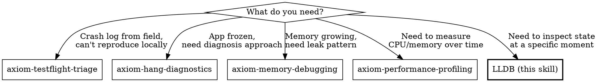

# LLDB Debugging

Interactive debugging with LLDB. The debugger freezes time so you can interrogate your running app — inspect variables, evaluate expressions, navigate threads, and understand exactly why something went wrong.

**Core insight:** "LLDB is useless" really means "I don't know which command to use for Swift types." This is a knowledge-gap problem, not a tool problem.

## Red Flags — Check This Skill When

| Symptom | This Skill Applies |
|---------|-------------------|
| Need to inspect a variable at runtime | Yes — breakpoint + inspect |
| Crash you can reproduce locally | Yes — breakpoint before crash site |
| Wrong value at runtime but code looks correct | Yes — step through and inspect |
| Need to understand thread state during hang | Yes — pause + thread backtrace |
| `po` doesn't work / shows garbage | Yes — Playbook 3 has alternatives |
| Crash log analyzed, need to reproduce | Yes — set breakpoints from crash context |
| Need to test a fix without rebuilding | Yes — expression evaluation |
| Want to break on all exceptions | Yes — exception breakpoints |
| App feels slow but responsive | No — use axiom-performance-profiling |
| Memory grows over time | No — use axiom-memory-debugging first |
| App completely frozen | Maybe — use axiom-hang-diagnostics first, then LLDB for thread inspection |
| Crash in production, no local repro | No — use axiom-testflight-triage first |

## LLDB vs Other Tools



**Rule of thumb:** Instruments *measures*. LLDB *inspects*. If you need to understand what's happening at a specific moment in time, use LLDB. If you need to understand trends over time, use Instruments.

## Response Format

When helping with LLDB debugging, structure your output as:

1. **Immediate diagnosis** (1-3 bullets, confidence-tagged: HIGH/MEDIUM/LOW)
2. **Commands to run** (numbered, copy-paste ready, with `(lldb)` prefix)
3. **What to look for** (command → expected output → interpretation)
4. **Likely root causes** (ranked by probability)
5. **Next breakpoint plan** (catch it earlier next time)
6. **If no debugger attached** (crash-log-only fallback path)

---

## Playbook 1: Crash Triage

**Goal:** Understand why the app crashed, starting from the stop point.

### Step 1: Read the Stop Reason

When the debugger stops, the first thing to check:

```
(lldb) thread info
```

This shows the stop reason. Common stop reasons:

| Stop Reason | Meaning | Next Step |
|-------------|---------|-----------|
| `EXC_BAD_ACCESS (SIGSEGV)` | Accessed invalid memory (null pointer, dangling reference) | Check the address — `0x0` to `0x10` = nil dereference |
| `EXC_BAD_ACCESS (SIGBUS)` | Misaligned or invalid address | Usually C interop or unsafe pointer issue |
| `EXC_BREAKPOINT (SIGTRAP)` | Hit a trap — Swift runtime check failed | Check for `fatalError()`, `preconditionFailure()`, force-unwrap of nil, array out of bounds |
| `EXC_CRASH (SIGABRT)` | Deliberate abort — assertion or uncaught exception | Look at "Application Specific Information" for the message |
| `breakpoint` | Your breakpoint was hit | Normal — inspect state |

### Step 2: Get the Backtrace

```
(lldb) bt
```

Read top-to-bottom. Find the first frame in YOUR code (not system frameworks). That's where to start investigating.

```
(lldb) bt 10
```

Limit to 10 frames if the full trace is noisy.

### Step 3: Navigate to Your Frame

```
(lldb) frame select 3
```

Jump to frame 3 (or whichever frame is in your code).

### Step 4: Inspect State

```
(lldb) v
(lldb) v self.someProperty
(lldb) v localVariable
```

Use `v` (not `po`) for reliable Swift value inspection. See Playbook 3 for details.

### Step 5: Classify and Fix

| Exception Type | Typical Cause | Fix Pattern |
|----------------|---------------|-------------|
| `EXC_BAD_ACCESS` at low address | Force-unwrap nil optional | `guard let` / `if let` |
| `EXC_BAD_ACCESS` at high address | Use-after-free / dangling pointer | Check object lifetime, `[weak self]` |
| `EXC_BREAKPOINT` | Swift runtime trap (bounds, unwrap, precondition) | Fix the violated precondition |
| `SIGABRT` | Uncaught ObjC exception or `fatalError()` | Read the exception message, fix the root cause |

### Step 6: Set a Conditional Breakpoint to Catch It Earlier

```
(lldb) breakpoint set -f MyFile.swift -l 42 -c "value == nil"
```

This breaks only when `value` is nil at line 42 — catches the problem before the crash.

---

## Playbook 2: Hang/Deadlock Diagnosis

**Goal:** Understand why the app is frozen by inspecting all thread states.

### Step 1: Pause the App

If the app is hung, press the pause button in Xcode (⌃⌘Y) or:

```
(lldb) process interrupt
```

### Step 2: Get All Thread Backtraces

```
(lldb) thread backtrace all
```

Or the shorthand:

```
(lldb) bt all
```

### Step 3: Classify Thread States

Look at Thread 0 (main thread) — it processes all UI events. If it's blocked, the app is frozen.

**Main thread blocked on synchronous wait:**
```
frame #0: libsystem_kernel.dylib`__psynch_mutexwait
frame #1: libsystem_pthread.dylib`_pthread_mutex_firstfit_lock_wait
...
frame #5: MyApp`ViewController.viewDidLoad()
```
Translation: Main thread is waiting for a mutex lock. Something else holds it.

**Main thread blocked on dispatch_sync:**
```
frame #0: libdispatch.dylib`_dispatch_sync_f_slow
...
frame #3: MyApp`DataManager.fetchData()
```
Translation: `DispatchQueue.main.sync` called from background → classic deadlock.

**Main thread busy (CPU-bound):**
```
frame #0: MyApp`ImageProcessor.processAllImages()
frame #1: MyApp`ViewController.viewDidLoad()
```
Translation: Expensive work on main thread. Move to background.

### Step 4: Check for Deadlocks

If two threads are both waiting on something the other holds:

```
(lldb) thread list
```

Look for multiple threads with state `waiting` that reference each other's locks.

### Step 5: Inspect Specific Thread

```
(lldb) thread select 3
(lldb) bt
(lldb) v
```

Switch to another thread to inspect its state.

**Cross-reference:** For fix patterns once you've identified the hang cause → `$axiom-hang-diagnostics`

---

## Playbook 3: Swift Value Inspection

**This is the core value of this skill.** Most developers abandon LLDB because `po` doesn't work reliably with Swift types. Here's what actually works.

### The Four Print Commands

| Command | Full Form | What It Does | Best For |
|---------|-----------|--------------|----------|
| `v` | `frame variable` | Reads memory directly, no compilation | Swift structs, enums, locals — **your default** |
| `p` | `expression` (with formatter) | Compiles expression, shows formatted result | Computed properties, function calls |
| `po` | `expression --object-description` | Calls `debugDescription` | Classes with `CustomDebugStringConvertible` |
| `expr` | `expression` | Evaluates arbitrary code | Calling methods, modifying state |

### When to Use Each

**Start with `v`** — it's fastest and most reliable for stored properties:

```
(lldb) v self.userName
(lldb) v self.items[0]
(lldb) v localStruct
```

`v` works by reading memory directly. It doesn't compile anything, so it can't fail due to expression compilation errors.

**`v` limitation:** It only reads stored properties — computed properties, `lazy var` (before first access), and property wrapper projected values (`$binding`) won't show meaningful values. If a field looks wrong or missing with `v`, try `p` instead.

**Use `p` when `v` can't reach it:**

```
(lldb) p self.computedProperty
(lldb) p self.items.count
(lldb) p someFunction()
```

`p` compiles and executes the expression. Needed for computed properties and function calls.

**Use `po` for class descriptions:**

```
(lldb) po myObject
(lldb) po error
(lldb) po notification
```

`po` calls `debugDescription` on the result. Best for objects that have meaningful descriptions (NSError, Notification, etc.).

### The "LLDB Is Broken" Moments

| What You See | Why | Fix |
|--------------|-----|-----|
| `<uninitialized>` | `po` failed; variable hasn't been populated by optimizer | Use `v` instead |
| `expression failed to parse, unknown type name` | Swift expression parser can't resolve the type | Try `expr -l objc -- (id)0x12345` for ObjC objects, or use `v` |
| `<variable not available>` | Compiler optimized it out (Release build) | Rebuild with Debug, per-file `-Onone`, or `register read` as last resort |
| `error: Couldn't apply expression side effects` | Expression had side effects LLDB couldn't reverse | Try a simpler expression; avoid mutating state |
| `po` shows memory address instead of value | Object doesn't conform to `CustomDebugStringConvertible` | Use `v` for raw value, or implement the protocol |
| `cannot find 'self' in scope` | Breakpoint is in a context without `self` (static, closure) | Use `v` with the explicit variable name |
| `p` shows `$R0 = ...` but `po` crashes | Different compilation paths | Use `p` when it works; `po` adds an extra description step that can fail |

### Inspecting Optionals

```
(lldb) v optionalValue
```
Shows: `(String?) some = "hello"` or `(String?) none`

Don't use `po optionalValue` — it may show just `Optional("hello")` which is less useful.

### Inspecting Collections

```
(lldb) v myArray
(lldb) v myArray[2]
(lldb) v myDict
```

For large collections, limit output:

```
(lldb) p Array(myArray.prefix(5))
```

### Inspecting SwiftUI State

SwiftUI `@State` is backed by stored properties with underscore prefix:

```
(lldb) v self._isPresented
(lldb) v self._items
```

For `@Observable` models:

```
(lldb) v self.viewModel.propertyName
```

**Diagnosing "view doesn't update":** If a property changes (confirmed with `v`) but the SwiftUI view doesn't re-render, check which thread the mutation happens on with `bt`. `@Observable` mutations must happen on `@MainActor` for SwiftUI to observe them — mutations on a background actor won't trigger view updates. Use `Self._printChanges()` inside a view body to see which property triggered (or didn't trigger) a re-render:

```
(lldb) expr Self._printChanges()
```

For the full observation diagnostic tree → `$axiom-swiftui-debugging`

### Inspecting Actors

Actor state is best inspected with `v`, which reads memory directly without isolation concerns:

```
(lldb) v actor
```

Shows all stored properties. This works because LLDB pauses the entire process — you can read any memory regardless of actor isolation (which is a compile-time concept).

### Modifying Values at Runtime

```
(lldb) expr self.debugFlag = true
(lldb) expr myArray.append("test")
(lldb) expr self.view.backgroundColor = UIColor.red
```

Modify values without rebuilding. Useful for testing theories.

### Referencing Previous Results

LLDB assigns result variables (`$R0`, `$R1`, etc.):

```
(lldb) p someValue
$R0 = 42
(lldb) p $R0 + 10
$R1 = 52
```

---

## Playbook 4: Breakpoint Strategies

### Source Breakpoints (Basic)

```
(lldb) breakpoint set -f ViewController.swift -l 42
(lldb) b ViewController.swift:42
```

Short form `b` works for simple cases.

### Conditional Breakpoints

Break only when a condition is true:

```
(lldb) breakpoint set -f MyFile.swift -l 42 -c "index > 100"
(lldb) breakpoint set -f MyFile.swift -l 42 -c "name == \"test\""
```

**Iteration-based:** Break after N hits:

```
(lldb) breakpoint set -f MyFile.swift -l 42 -i 50
```

Ignores the first 50 hits, then breaks.

### Logpoints (Action + Auto-Continue)

Log without stopping — like a print statement but no rebuild needed:

```
(lldb) breakpoint set -f MyFile.swift -l 42
(lldb) breakpoint command add 1
> v self.value
> continue
> DONE
```

Or in Xcode: Edit breakpoint → Add Action → "Log Message" → use `@self.value@` token syntax → Check "Automatically continue"

### Symbolic Breakpoints

Break on ANY call to a method by name:

```
(lldb) breakpoint set -n viewDidLoad
(lldb) breakpoint set -n "MyClass.myMethod"
```

Break on all ObjC messages to a selector:

```
(lldb) breakpoint set -S "layoutSubviews"
```

### Exception Breakpoints

**Swift errors (break on throw):**
```
(lldb) breakpoint set -E swift
```

**Objective-C exceptions (break on throw):**
```
(lldb) breakpoint set -E objc
```

**In Xcode:** Breakpoint Navigator → + → Swift Error Breakpoint / Exception Breakpoint

This is the single most useful breakpoint for crash debugging. It stops at the throw site instead of the catch/crash site.

### Watchpoints

Break when a variable's value changes:

```
(lldb) watchpoint set variable self.count
(lldb) watchpoint set variable -w read_write myGlobal
```

Watchpoints are hardware-backed — limited to ~4 per process but very fast.

### One-Shot Breakpoints

Break once, then auto-delete:

```
(lldb) breakpoint set -f MyFile.swift -l 42 -o
```

### Managing Breakpoints

```
(lldb) breakpoint list
(lldb) breakpoint disable 3
(lldb) breakpoint enable 3
(lldb) breakpoint delete 3
(lldb) breakpoint delete
```

---

## Playbook 5: Async/Concurrency Debugging

### Identifying Async Frames

Swift concurrency backtraces are noisy — expect `swift_task_switch`, `_dispatch_call_block_and_release`, and executor internals mixed in with your code. Don't be discouraged by 40+ frames of runtime noise. Focus on frames from YOUR module.

In Swift concurrency backtraces, look for `swift-task` frames:

```
Thread 3:
frame #0: MyApp`MyActor.doWork()
frame #1: swift_task_switch
frame #2: MyApp`closure #1 in ViewController.loadData()
```

The `swift_task_switch` frame indicates an async suspension point. Your code frames are the ones prefixed with your module name (`MyApp` above).

### Inspecting Task State

```
(lldb) thread backtrace all
```

Look for threads with `swift_task` in their frames. Each represents an active Swift task.

### Actor-Isolated Code

When stopped inside an actor:

```
(lldb) v self
```

Shows all actor state. This works because LLDB pauses the entire process — actor isolation is a compile-time concept, not a runtime lock (for default actors).

### Task Group Inspection

When debugging task groups, break inside the group closure and inspect:

```
(lldb) v
(lldb) bt
```

Each child task runs on its own thread. Use `bt all` to see them.

**Cross-reference:** For Swift concurrency patterns and fix strategies → `$axiom-swift-concurrency`. For profiling async performance → `$axiom-concurrency-profiling`

---

## Pressure Scenarios

### Scenario 1: "Release-Only Crash — LLDB Is Useless in Release"

**Situation:** Crash happens in Release builds but not Debug. Team says "we can't debug it."

**Why this fails:** Release optimizations change timing, memory layout, and can eliminate variables — making the crash non-reproducible in Debug.

**Correct approach:**

1. Build with Debug configuration but Release-like settings:
   - Optimization Level: `-O` (not `-Onone`)
   - Still include debug symbols (`DEBUG_INFORMATION_FORMAT = dwarf-with-dsym`)
2. Enable Address Sanitizer (`-fsanitize=address`) — catches memory errors with 2-3x overhead
3. Use the crash report to set breakpoints at the crash site
4. Set exception breakpoints to catch the error before the crash:
   ```
   (lldb) breakpoint set -E swift
   (lldb) breakpoint set -E objc
   ```
5. If variable shows `<optimized out>`, reduce optimization for that one file:
   - Build Settings → Per-file flags → `-Onone` for the specific file
6. Last resort — read register values directly (variables live in registers before being optimized out):
   ```
   (lldb) register read
   (lldb) register read x0 x1 x2
   ```
   On ARM64: `x0` = self, `x1`-`x7` = first 7 arguments. Check `$axiom-lldb-ref` Part 1 for details.

### Scenario 2: "Just Add Print Statements"

**Situation:** Developer adds `print()` calls to debug, rebuilds, runs, reads console. Repeat.

**Why this fails:** Each print-debug cycle costs 3-5 minutes (edit → build → run → navigate to state → read output). An LLDB breakpoint costs 30 seconds.

**Correct approach:**

1. Set a breakpoint at the line you'd add a `print()`:
   ```
   (lldb) b MyFile.swift:42
   ```
2. Add a logpoint for "print-like" behavior without rebuilding:
   - Edit breakpoint → Add Action → Log Message → Check "Auto continue"
3. Inspect variables directly: `v self.someValue`
4. Modify variables at runtime to test theories: `expr self.debugMode = true`
5. **One breakpoint session replaces 5-10 print-debug cycles.**

**Time comparison** (typical control-flow debugging):
| Approach | Per investigation | 5 variables |
|----------|-------------------|-------------|
| print() statements | 3-5 min (build + run) | 15-25 min |
| LLDB breakpoint | 30 sec (set + inspect) | 2.5 min |

**Exception:** In tight loops (thousands of hits/sec), logpoints add per-hit overhead. Use `-i` to skip to the iteration you care about, or use a temporary `print()` for that specific loop.

### Scenario 3: "po Doesn't Work So LLDB Is Broken"

**Situation:** Developer types `po myStruct` and gets garbage. Concludes LLDB is broken for Swift. Goes back to print debugging.

**This is the #1 reason developers abandon LLDB.**

**Why `po` fails with Swift structs:** `po` calls `debugDescription` which requires compiling an expression in the debugger context. For Swift structs, this compilation often fails due to missing type metadata, generics, or module resolution issues.

**Correct approach:**

1. Use `v` instead of `po` — reads memory directly, no compilation:
   ```
   (lldb) v myStruct
   (lldb) v myStruct.propertyName
   ```
2. Use `p` for computed properties:
   ```
   (lldb) p myStruct.computedValue
   ```
3. Use `po` only for classes with `CustomDebugStringConvertible`
4. If `p` also fails, try specifying the language:
   ```
   (lldb) expr -l objc -- (id)0x12345
   ```
5. If everything fails, `v self` always works inside a method.

---

## Anti-Patterns

| Anti-Pattern | Why It's Wrong | Better Alternative |
|---|---|---|
| `po` everything | Fails for Swift structs, enums, optionals | `v` for values, `po` only for classes |
| Print-debug cycles | 3-5 min per cycle vs 30 sec breakpoint | Breakpoints with logpoint actions |
| "LLDB doesn't work with Swift" | It does — wrong command choice | `v` is designed for Swift values |
| Ignoring backtraces | Jumping to guesses instead of reading the trace | `bt` first, then navigate frames |
| Conditional breakpoints on every hit | Slows execution if condition is expensive | Use `-i` (ignore count) when possible |
| Debugging optimized (Release) builds | Variables missing, code reordered | Debug configuration, or per-file `-Onone` |
| Force-continuing past exceptions | Hides the real error | Fix the exception, don't suppress it |
| No exception breakpoints set | Crashes land in system code, not throw site | Always add Swift Error + ObjC Exception breakpoints |

## Debugging Checklist

Before starting a debug session:

- [ ] Debug build configuration (not Release)
- [ ] Exception breakpoints enabled (Swift Error + ObjC Exception)
- [ ] Breakpoint set before suspected problem area
- [ ] Know which command to use: `v` for values, `p` for computed, `po` for descriptions

During debug session:

- [ ] Read stop reason (`thread info`) before anything else
- [ ] Get backtrace (`bt`) — find your frame
- [ ] Navigate to your frame (`frame select N`)
- [ ] Inspect relevant state (`v self`, `v localVar`)
- [ ] Understand the cause before writing any fix

After finding the issue:

- [ ] Set conditional breakpoint to catch recurrence
- [ ] Consider adding assertion/precondition for this case
- [ ] Remove temporary breakpoints

## Resources

**WWDC**: 2019-429, 2018-412, 2022-110370

**Docs**: /xcode/stepping-through-code-and-inspecting-variables-to-isolate-bugs, /xcode/setting-breakpoints-to-pause-your-running-app, /xcode/diagnosing-memory-thread-and-crash-issues-early

**Skills**: axiom-lldb-ref, axiom-testflight-triage, axiom-hang-diagnostics, axiom-memory-debugging, axiom-swift-concurrency, axiom-concurrency-profiling
