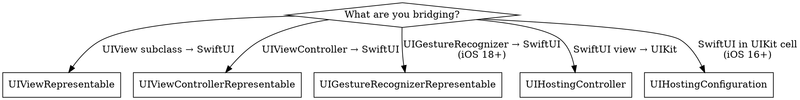

# UIKit-SwiftUI Bridging

Systematic guidance for bridging UIKit and SwiftUI. Most production iOS apps need both — this skill teaches the bridging patterns themselves, not the domain-specific views being bridged.

## Decision Framework



**Quick rules:**
- Wrapping a `UIView` → `UIViewRepresentable` (Part 1)
- Wrapping a `UIViewController` → `UIViewControllerRepresentable` (Part 2)
- Wrapping a `UIGestureRecognizer` subclass → `UIGestureRecognizerRepresentable` (Part 2b, iOS 18+)
- Embedding SwiftUI in UIKit navigation → `UIHostingController` (Part 3)
- SwiftUI in UICollectionView/UITableView cells → `UIHostingConfiguration` (Part 3)
- Sharing state between UIKit and SwiftUI → `@Observable` shared model (Part 4)

---

# Part 1: UIViewRepresentable — Wrapping UIViews

Use when you have a `UIView` subclass (MKMapView, WKWebView, custom drawing views) and need it in SwiftUI.

## Lifecycle

```
makeUIView(context:)         → Called ONCE. Create and configure the view.
updateUIView(_:context:)     → Called on EVERY SwiftUI state change. Patch, don't recreate.
dismantleUIView(_:coordinator:) → Called when removed from hierarchy. Clean up observers/timers.
```

**Critical**: `updateUIView` is called frequently. Guard against unnecessary work:

```swift
struct MapView: UIViewRepresentable {
    let region: MKCoordinateRegion

    func makeUIView(context: Context) -> MKMapView {
        let map = MKMapView()
        map.delegate = context.coordinator
        return map
    }

    func updateUIView(_ map: MKMapView, context: Context) {
        // ✅ Guard: only update if region actually changed
        if map.region.center.latitude != region.center.latitude
            || map.region.center.longitude != region.center.longitude {
            map.setRegion(region, animated: true)
        }
    }

    static func dismantleUIView(_ map: MKMapView, coordinator: Coordinator) {
        map.removeAnnotations(map.annotations)
    }
}
```

## State Synchronization

State flows in two directions across the bridge:

**SwiftUI → UIKit**: Via `updateUIView`. SwiftUI state changes trigger this method.

**UIKit → SwiftUI**: Via the Coordinator, using `@Binding` on the parent struct.

```swift
struct SearchField: UIViewRepresentable {
    @Binding var text: String
    @Binding var isEditing: Bool

    func makeUIView(context: Context) -> UISearchBar {
        let bar = UISearchBar()
        bar.delegate = context.coordinator
        return bar
    }

    func updateUIView(_ bar: UISearchBar, context: Context) {
        bar.text = text  // SwiftUI → UIKit
    }

    func makeCoordinator() -> Coordinator { Coordinator(self) }

    class Coordinator: NSObject, UISearchBarDelegate {
        var parent: SearchField

        init(_ parent: SearchField) { self.parent = parent }

        func searchBar(_ searchBar: UISearchBar, textDidChange searchText: String) {
            parent.text = searchText  // UIKit → SwiftUI
        }

        func searchBarTextDidBeginEditing(_ searchBar: UISearchBar) {
            parent.isEditing = true  // UIKit → SwiftUI
        }

        func searchBarTextDidEndEditing(_ searchBar: UISearchBar) {
            parent.isEditing = false
        }
    }
}
```

## Layout Property Warning

SwiftUI owns the layout of representable views. **Never modify `center`, `bounds`, `frame`, or `transform`** on the wrapped UIView — this is undefined behavior per Apple documentation. SwiftUI sets these properties during its layout pass. If you need custom sizing, override `intrinsicContentSize` on the UIView or use `sizeThatFits(_:)`.

## Coordinator Pattern

The Coordinator is a reference type (`class`) that:
1. Acts as the delegate/data source for the UIKit view
2. Holds a reference to the parent `UIViewRepresentable` struct
3. Bridges UIKit callbacks back to SwiftUI `@Binding` properties

`makeCoordinator()` is **optional** — omit it when the UIKit view needs no delegate callbacks or UIKit→SwiftUI communication (e.g., a static display-only view).

**Why not closures?** Closures capture `self` and create retain cycles. The Coordinator pattern gives you a stable reference type that SwiftUI manages.

```swift
// ❌ Closure-based: retain cycle risk, no delegate protocol support
func makeUIView(context: Context) -> UITextField {
    let field = UITextField()
    field.addTarget(self, action: #selector(textChanged), for: .editingChanged) // Won't compile — self is a struct
    return field
}

// ✅ Coordinator: clean lifecycle, delegate support
func makeCoordinator() -> Coordinator { Coordinator(self) }

class Coordinator: NSObject, UITextFieldDelegate {
    var parent: SearchField
    init(_ parent: SearchField) { self.parent = parent }

    func textFieldDidChangeSelection(_ textField: UITextField) {
        parent.text = textField.text ?? ""
    }
}
```

## Sizing

UIViewRepresentable views participate in SwiftUI layout. Control sizing with:

```swift
// If the UIView has intrinsicContentSize, SwiftUI respects it
// For views without intrinsic size (MKMapView, WKWebView), set a frame:
MapView(region: region)
    .frame(height: 300)

// For views that should size to fit their content:
WrappedLabel(text: "Hello")
    .fixedSize()  // Uses intrinsicContentSize
```

Override `sizeThatFits(_:)` for custom size proposals:

```swift
struct WrappedLabel: UIViewRepresentable {
    let text: String

    func makeUIView(context: Context) -> UILabel {
        let label = UILabel()
        label.numberOfLines = 0
        return label
    }

    func updateUIView(_ label: UILabel, context: Context) {
        label.text = text
    }

    // Custom size proposal — SwiftUI calls this during layout
    func sizeThatFits(_ proposal: ProposedViewSize, uiView: UILabel, context: Context) -> CGSize? {
        let width = proposal.width ?? UIView.layoutFittingCompressedSize.width
        return uiView.systemLayoutSizeFitting(
            CGSize(width: width, height: UIView.layoutFittingCompressedSize.height),
            withHorizontalFittingPriority: .required,
            verticalFittingPriority: .fittingSizeLevel
        )
    }
}
```

## Scroll-Tracking Navigation Bars (iOS 15+)

When wrapping a UIScrollView subclass, tell the navigation bar which scroll view to track for large title collapse:

```swift
func makeUIView(context: Context) -> UITableView {
    let table = UITableView()
    return table
}

func updateUIView(_ table: UITableView, context: Context) {
    // Tell the nearest navigation controller to track this scroll view
    // for inline/large title transitions
    if let navController = sequence(first: table as UIResponder, next: \.next)
        .compactMap({ $0 as? UINavigationController }).first {
        navController.navigationBar.setContentScrollView(table, forEdge: .top)
    }
}
```

Without this, navigation bar large titles won't collapse when scrolling a wrapped UIScrollView.

## Animation Bridging

Use `context.transaction.animation` to bridge SwiftUI animations into UIKit:

```swift
func updateUIView(_ uiView: UIView, context: Context) {
    if context.transaction.animation != nil {
        UIView.animate(withDuration: 0.3) {
            uiView.alpha = isVisible ? 1 : 0
        }
    } else {
        uiView.alpha = isVisible ? 1 : 0
    }
}
```

**iOS 18+ animation unification**: SwiftUI animations can be applied directly to UIKit views via `UIView.animate(_:)`. However, be aware of incompatibilities:

- SwiftUI animations are **NOT backed by CAAnimation** — they use a different rendering path
- **Incompatible with** `UIViewPropertyAnimator` and `UIView` keyframe animations
- **Velocity retargeting**: Re-targeted SwiftUI animations carry forward velocity from interrupted animations, creating fluid transitions

For comprehensive animation bridging patterns, see `$axiom-swiftui-animation-ref` Part 10.

---

# Part 2: UIViewControllerRepresentable — Wrapping UIViewControllers

Use when wrapping a full `UIViewController` — pickers, mail compose, Safari, camera, or any controller that manages its own view hierarchy.

## Lifecycle

```
makeUIViewController(context:)         → Called ONCE. Create and configure.
updateUIViewController(_:context:)     → Called on SwiftUI state changes.
dismantleUIViewController(_:coordinator:) → Cleanup.
```

## Canonical Example: PHPickerViewController

```swift
struct PhotoPicker: UIViewControllerRepresentable {
    @Binding var selectedImages: [UIImage]
    @Environment(\.dismiss) private var dismiss

    func makeUIViewController(context: Context) -> PHPickerViewController {
        var config = PHPickerConfiguration()
        config.selectionLimit = 5
        config.filter = .images
        let picker = PHPickerViewController(configuration: config)
        picker.delegate = context.coordinator
        return picker
    }

    func updateUIViewController(_ picker: PHPickerViewController, context: Context) {
        // PHPicker doesn't support updates after creation
    }

    func makeCoordinator() -> Coordinator { Coordinator(self) }

    class Coordinator: NSObject, PHPickerViewControllerDelegate {
        var parent: PhotoPicker

        init(_ parent: PhotoPicker) { self.parent = parent }

        func picker(_ picker: PHPickerViewController, didFinishPicking results: [PHPickerResult]) {
            parent.selectedImages = []
            for result in results {
                result.itemProvider.loadObject(ofClass: UIImage.self) { image, _ in
                    if let image = image as? UIImage {
                        DispatchQueue.main.async {
                            self.parent.selectedImages.append(image)
                        }
                    }
                }
            }
            parent.dismiss()
        }
    }
}
```

## When the Controller Presents Its Own UI

Some controllers (UIImagePickerController, MFMailComposeViewController, SFSafariViewController) present their own full-screen UI. Handle dismissal through the coordinator:

```swift
class Coordinator: NSObject, MFMailComposeViewControllerDelegate {
    var parent: MailComposer

    func mailComposeController(_ controller: MFMailComposeViewController,
                                didFinishWith result: MFMailComposeResult, error: Error?) {
        parent.dismiss()  // Let SwiftUI handle the dismissal
    }
}
```

**Don't** call `controller.dismiss(animated:)` directly from the coordinator — let SwiftUI's `@Environment(\.dismiss)` or the binding that controls presentation handle it.

## Presentation Context

The wrapped controller doesn't automatically inherit SwiftUI's navigation context. If you need the controller to push onto a navigation stack, you need UIViewControllerRepresentable inside a NavigationStack, and the controller needs access to the navigation controller:

```swift
// ❌ This won't push — the controller has no navigationController
struct WrappedVC: UIViewControllerRepresentable {
    func makeUIViewController(context: Context) -> MyViewController {
        let vc = MyViewController()
        vc.navigationController?.pushViewController(otherVC, animated: true) // nil
        return vc
    }
}

// ✅ Present modally instead, or use UIHostingController in a UIKit navigation flow
.sheet(isPresented: $showPicker) {
    PhotoPicker(selectedImages: $images)
}
```

---

# Part 2b: UIGestureRecognizerRepresentable (iOS 18+)

Use when you need a UIKit gesture recognizer in SwiftUI — for gestures that SwiftUI's native gesture API doesn't support (custom subclasses, precise UIKit gesture state machine, hit testing control).

**Pre-iOS 18 fallback**: Attach the gesture recognizer to a transparent `UIView` wrapped with `UIViewRepresentable`, using the Coordinator as the target/action receiver (see Part 1 Coordinator Pattern). You lose `CoordinateSpaceConverter` but can use the recognizer's `location(in:)` directly.

## Lifecycle

```
makeUIGestureRecognizer(context:)              → Called ONCE. Create the recognizer.
handleUIGestureRecognizerAction(_:context:)    → Called when the gesture is recognized.
updateUIGestureRecognizer(_:context:)          → Called on SwiftUI state changes.
makeCoordinator(converter:)                    → Optional. Create coordinator for state.
```

**No manual target/action** — the system manages action target installation. Implement `handleUIGestureRecognizerAction` instead.

## Canonical Example: Long Press with Location

```swift
struct LongPressGesture: UIGestureRecognizerRepresentable {
    @Binding var pressLocation: CGPoint?

    func makeUIGestureRecognizer(context: Context) -> UILongPressGestureRecognizer {
        let recognizer = UILongPressGestureRecognizer()
        recognizer.minimumPressDuration = 0.5
        return recognizer
    }

    func handleUIGestureRecognizerAction(
        _ recognizer: UILongPressGestureRecognizer, context: Context
    ) {
        switch recognizer.state {
        case .began:
            // localLocation converts UIKit coordinates to SwiftUI coordinate space
            pressLocation = context.converter.localLocation
        case .ended, .cancelled:
            pressLocation = nil
        default:
            break
        }
    }
}

// Usage
struct ContentView: View {
    @State private var pressLocation: CGPoint?

    var body: some View {
        Rectangle()
            .gesture(LongPressGesture(pressLocation: $pressLocation))
    }
}
```

## CoordinateSpaceConverter

The `context.converter` bridges UIKit gesture coordinates into SwiftUI coordinate spaces:

| Property/Method | Description |
|-----------------|-------------|
| `localLocation` | Gesture position in the attached SwiftUI view's space |
| `localTranslation` | Gesture movement in local space |
| `localVelocity` | Gesture velocity in local space |
| `location(in:)` | Transform location to an ancestor coordinate space |
| `translation(in:)` | Transform translation to an ancestor space |
| `velocity(in:)` | Transform velocity to an ancestor space |

## When to Use This vs SwiftUI Gestures

| Need | Use |
|------|-----|
| Standard tap, drag, long press, rotation, magnification | SwiftUI native gestures |
| Custom `UIGestureRecognizer` subclass | `UIGestureRecognizerRepresentable` |
| Precise control over gesture state machine (`.possible`, `.began`, `.changed`, etc.) | `UIGestureRecognizerRepresentable` |
| Gesture that requires `delegate` methods for failure requirements or simultaneous recognition | `UIGestureRecognizerRepresentable` with a Coordinator |
| Coordinate space conversion between UIKit and SwiftUI | `UIGestureRecognizerRepresentable` (converter is built-in) |

---

# Part 3: UIHostingController — SwiftUI Inside UIKit

Use when embedding SwiftUI views in an existing UIKit navigation hierarchy.

## Basic Embedding

```swift
// Push onto UIKit navigation stack
let profileView = ProfileView(user: user)
let hostingController = UIHostingController(rootView: profileView)
navigationController?.pushViewController(hostingController, animated: true)

// Present modally
let settingsView = SettingsView()
let hostingController = UIHostingController(rootView: settingsView)
hostingController.modalPresentationStyle = .pageSheet
present(hostingController, animated: true)
```

## Child View Controller Embedding

When embedding as a child VC (e.g., a SwiftUI card inside a UIKit layout):

```swift
let swiftUIView = StatusCard(status: currentStatus)
let hostingController = UIHostingController(rootView: swiftUIView)
hostingController.sizingOptions = .intrinsicContentSize  // iOS 16+

addChild(hostingController)
view.addSubview(hostingController.view)
hostingController.view.translatesAutoresizingMaskIntoConstraints = false
NSLayoutConstraint.activate([
    hostingController.view.leadingAnchor.constraint(equalTo: view.leadingAnchor),
    hostingController.view.trailingAnchor.constraint(equalTo: view.trailingAnchor),
    hostingController.view.topAnchor.constraint(equalTo: headerView.bottomAnchor)
])
hostingController.didMove(toParent: self)
```

**`sizingOptions: .intrinsicContentSize`** (iOS 16+) makes the hosting controller report its SwiftUI content size to Auto Layout. Without this, the hosting controller's view has no intrinsic size and relies entirely on constraints.

**`sizingOptions` cases** (iOS 16+, `OptionSet`):
- `.intrinsicContentSize` — auto-invalidates intrinsic content size when SwiftUI content changes
- `.preferredContentSize` — tracks content's ideal size in the controller's `preferredContentSize`

## Explicit Size Queries

Use `sizeThatFits(in:)` to calculate the SwiftUI content's preferred size for Auto Layout integration:

```swift
let hostingController = UIHostingController(rootView: CompactCard(item: item))

// Query preferred size for a given width constraint
let fittingSize = hostingController.sizeThatFits(in: CGSize(width: 320, height: .infinity))
// Returns the optimal CGSize for the SwiftUI content
```

This is useful when you need the hosting controller's size before adding it to the view hierarchy, or when embedding in contexts where `sizingOptions` alone isn't sufficient (e.g., manually sizing popover content).

## Environment Bridging

Standard system environment values (`colorScheme`, `sizeCategory`, `locale`) bridge automatically through the UIKit trait system. Custom `@Environment` keys from a parent SwiftUI view do NOT — unless you use `UITraitBridgedEnvironmentKey`.

**Option 1: Inject explicitly** (simplest, works on all versions):

```swift
let view = DetailView(store: appStore, theme: currentTheme)
let hostingController = UIHostingController(rootView: view)
```

**Option 2: UITraitBridgedEnvironmentKey** (iOS 17+, bidirectional bridging):

Bridge custom environment values between UIKit traits and SwiftUI environment:

```swift
// 1. Define a UIKit trait
struct FeatureOneTrait: UITraitDefinition {
    static let defaultValue = false
}

extension UIMutableTraits {
    var featureOne: Bool {
        get { self[FeatureOneTrait.self] }
        set { self[FeatureOneTrait.self] = newValue }
    }
}

// 2. Define a SwiftUI EnvironmentKey
struct FeatureOneKey: EnvironmentKey {
    static let defaultValue = false
}

extension EnvironmentValues {
    var featureOne: Bool {
        get { self[FeatureOneKey.self] }
        set { self[FeatureOneKey.self] = newValue }
    }
}

// 3. Bridge them
extension FeatureOneKey: UITraitBridgedEnvironmentKey {
    static func read(from traitCollection: UITraitCollection) -> Bool {
        traitCollection[FeatureOneTrait.self]
    }
    static func write(to mutableTraits: inout UIMutableTraits, value: Bool) {
        mutableTraits.featureOne = value
    }
}
```

Now `@Environment(\.featureOne)` automatically syncs in both directions — UIKit `traitOverrides` update SwiftUI views, and SwiftUI `.environment(\.featureOne, true)` updates UIKit views.

To push values from UIKit into hosted SwiftUI content:

```swift
// In any UIKit view controller — flows down to UIHostingController children
viewController.traitOverrides.featureOne = true
```

## UIHostingConfiguration (iOS 16+)

Use SwiftUI views as UICollectionView or UITableView cells:

```swift
cell.contentConfiguration = UIHostingConfiguration {
    HStack {
        Image(systemName: item.icon)
            .foregroundStyle(.tint)
        VStack(alignment: .leading) {
            Text(item.title)
                .font(.headline)
            Text(item.subtitle)
                .font(.subheadline)
                .foregroundStyle(.secondary)
        }
    }
}
.margins(.all, EdgeInsets(top: 8, leading: 16, bottom: 8, trailing: 16))
.minSize(width: nil, height: 44)  // Minimum tap target height
.background(.quaternarySystemFill)  // ShapeStyle background
```

**Cell clipping?** UIHostingConfiguration cells self-size. If cells are clipped, the collection view layout likely uses fixed `itemSize` — switch to `estimated` dimensions in your compositional layout so cells can grow to fit the SwiftUI content.

#### Advantages over full UIHostingController
- No child view controller management
- Automatic cell sizing
- Self-sizing invalidation on state change
- Compatible with diffable data sources

#### When to use UIHostingConfiguration vs UIHostingController

| Scenario | Use |
|----------|-----|
| Cell content in UICollectionView/UITableView | UIHostingConfiguration |
| Full screen or navigation destination | UIHostingController |
| Child VC in a layout | UIHostingController |
| Overlay or decoration | UIHostingConfiguration in a supplementary view |

## Scroll-Tracking for Navigation Bars

When a UIHostingController contains a scroll view and is pushed onto a UINavigationController, large title collapse may not work. Use `setContentScrollView`:

```swift
let hostingController = UIHostingController(rootView: ScrollableListView())

// After pushing, tell the nav bar to track the scroll view
if let scrollView = hostingController.view.subviews.compactMap({ $0 as? UIScrollView }).first {
    navigationController?.navigationBar.setContentScrollView(scrollView, forEdge: .top)
}
```

This is a common issue when embedding SwiftUI `List` or `ScrollView` in UIKit navigation.

## Keyboard Handling in Hybrid Layouts

When mixing UIKit and SwiftUI, keyboard avoidance may not work automatically. Use `UIKeyboardLayoutGuide` (iOS 15+) for constraint-based keyboard tracking in UIKit layouts that contain SwiftUI content:

```swift
// Constrain the hosting controller's view above the keyboard
hostingController.view.bottomAnchor.constraint(
    equalTo: view.keyboardLayoutGuide.topAnchor
).isActive = true
```

---

# Part 4: Shared State with @Observable

When UIKit and SwiftUI coexist in the same app, you need a shared model layer. `@Observable` (iOS 17+) works naturally in both frameworks without Combine.

## @Observable as the Shared Model Layer

```swift
@Observable
class AppState {
    var userName: String = ""
    var isLoggedIn: Bool = false
    var itemCount: Int = 0
}
```

**SwiftUI side** — standard property wrappers:

```swift
struct ProfileView: View {
    @State var appState: AppState  // or @Environment, @Bindable

    var body: some View {
        Text("Welcome, \(appState.userName)")
        Text("\(appState.itemCount) items")
    }
}
```

**Why UIKit needs explicit observation**: SwiftUI's rendering engine automatically participates in the Observation framework — when a view's `body` accesses an `@Observable` property, SwiftUI registers that access and re-renders when it changes. UIKit is imperative and has no equivalent re-evaluation mechanism, so you must opt in explicitly.

**UIKit side (pre-iOS 26)** — manual observation with `withObservationTracking()`:

```swift
class DashboardViewController: UIViewController {
    let appState: AppState

    override func viewDidLoad() {
        super.viewDidLoad()
        observeState()
    }

    private func observeState() {
        withObservationTracking {
            // Properties accessed here are tracked
            titleLabel.text = appState.userName
            countLabel.text = "\(appState.itemCount) items"
        } onChange: {
            // Fires ONCE on the thread that mutated the property — must re-register
            // Always dispatch to main: onChange can fire on ANY thread
            DispatchQueue.main.async { [weak self] in
                self?.observeState()
            }
        }
    }
}
```

**UIKit side (iOS 26+)** — automatic observation tracking:

UIKit automatically tracks `@Observable` property access in designated lifecycle methods. Properties read in these methods trigger automatic UI updates when they change:

| Method | Class | What it updates |
|--------|-------|----------------|
| `updateProperties()` | UIView, UIViewController | Content and styling |
| `layoutSubviews()` | UIView | Geometry and positioning |
| `viewWillLayoutSubviews()` | UIViewController | Pre-layout |
| `draw(_:)` | UIView | Custom drawing |

```swift
class DashboardViewController: UIViewController {
    let appState: AppState

    // iOS 26+: Properties accessed here are auto-tracked
    override func updateProperties() {
        super.updateProperties()
        titleLabel.text = appState.userName
        countLabel.text = "\(appState.itemCount) items"
    }
}
```

**Info.plist requirement**: In iOS 18, add `UIObservationTrackingEnabled = true` to your Info.plist to enable automatic observation tracking. iOS 26+ enables it by default.

## iOS 16 Fallback: ObservableObject + Combine

If targeting iOS 16 (before `@Observable`), use `ObservableObject` with `@Published` and observe via Combine on the UIKit side:

```swift
class AppState: ObservableObject {
    @Published var userName: String = ""
    @Published var itemCount: Int = 0
}

// UIKit side — observe with Combine sink
class DashboardViewController: UIViewController {
    let appState: AppState
    private var cancellables = Set<AnyCancellable>()

    override func viewDidLoad() {
        super.viewDidLoad()
        appState.$userName
            .receive(on: DispatchQueue.main)
            .sink { [weak self] name in
                self?.titleLabel.text = name
            }
            .store(in: &cancellables)
    }
}
```

## Migration Note

`@Observable` replaces `ObservableObject` + `@Published` without requiring Combine. For hybrid apps:
- Replace `ObservableObject` classes with `@Observable`
- Remove `@Published` property wrappers (observation is automatic)
- SwiftUI views keep working — `@State` and `@Environment` support `@Observable` directly
- UIKit views gain observation through `withObservationTracking()` (iOS 17+) or automatic tracking (iOS 26+)

---

# Part 5: Common Gotchas

| Gotcha | Symptom | Fix |
|--------|---------|-----|
| Coordinator retains parent | Memory leak, views never deallocate | Coordinator stores `var parent: X` (not `let`). SwiftUI updates the parent reference on each `updateUIView` call. Don't add extra strong references. |
| updateUIView called excessively | UIKit view flickers, resets scroll position, drops user input | Guard with equality checks. Compare old vs new values before applying changes. |
| Environment doesn't cross bridge | Custom environment values are nil/default | Use `UITraitBridgedEnvironmentKey` (iOS 17+) for bidirectional bridging, or inject dependencies through initializer. System traits (color scheme, size category) bridge automatically. |
| Large title won't collapse | Navigation bar stays expanded when scrolling wrapped UIScrollView | Call `setContentScrollView(_:forEdge:)` on the navigation bar. |
| UIHostingController sizing wrong | View is zero-sized or jumps after layout | Use `sizingOptions: .intrinsicContentSize` (iOS 16+). For earlier versions, call `hostingController.view.invalidateIntrinsicContentSize()` after root view changes. |
| Mixed navigation stacks | Unpredictable back button behavior, lost state | Don't mix UINavigationController and NavigationStack in the same flow. Migrate entire navigation subtrees. |
| makeUIView called multiple times | View recreated unexpectedly | Ensure the `UIViewRepresentable` struct's identity is stable. Avoid putting it inside a conditional that changes identity. |
| Coordinator not receiving callbacks | Delegate methods never fire | Set `delegate = context.coordinator` in `makeUIView`, not `updateUIView`. Verify protocol conformance. |
| Layout properties modified on representable view | View jumps, disappears, or has inconsistent layout | Never modify `center`, `bounds`, `frame`, or `transform` on the wrapped UIView — SwiftUI owns these. |
| Keyboard hides content in hybrid layout | Text field or content hidden behind keyboard | Use `UIKeyboardLayoutGuide` (iOS 15+) constraints in UIKit, or ensure SwiftUI's keyboard avoidance isn't disabled. |
| @Observable not updating UIKit views | UIKit views show stale data after model changes | Use `withObservationTracking()` (iOS 17+) or enable `UIObservationTrackingEnabled` in Info.plist (iOS 18). iOS 26+ auto-tracks in `updateProperties()`. |

---

# Part 6: Anti-Patterns

| Pattern | Problem | Fix |
|---------|---------|-----|
| "I'll use UIViewRepresentable for the whole screen" | UIViewControllerRepresentable exists for controllers that manage their own view hierarchy, handle rotation, and participate in the responder chain | Use UIViewControllerRepresentable for UIViewControllers. UIViewRepresentable is for bare UIViews. |
| "I don't need a coordinator, I'll use closures" | Closures capture the struct value (not reference), become stale on updates, and can't conform to delegate protocols | Use the Coordinator. It's a stable reference type that SwiftUI keeps alive and updates. |
| "I'll rebuild the UIKit view every update" | `makeUIView` runs once. Recreating the view in `updateUIView` causes flickering, lost state, and performance issues. | Create in `makeUIView`. Patch properties in `updateUIView`. |
| "SwiftUI environment will just work across the bridge" | Custom `@Environment` values don't cross UIKit boundaries | Use `UITraitBridgedEnvironmentKey` (iOS 17+) for bridging, or inject explicitly through initializers. System trait-based values bridge automatically. |
| "I'll dismiss the UIKit controller directly" | Calling `dismiss(animated:)` from coordinator bypasses SwiftUI's presentation state, leaving bindings out of sync | Use `@Environment(\.dismiss)` or the `@Binding var isPresented` to let SwiftUI handle dismissal. |
| "I'll skip dismantleUIView, it'll clean up automatically" | Timers, observers, and KVO registrations on the UIView leak | Implement `dismantleUIView` (static method) for any cleanup that `deinit` alone won't handle. |

---

## Resources

**WWDC**: 2019-231, 2022-10072, 2023-10149, 2024-10118, 2024-10145, 2025-243, 2025-256

**Docs**: /swiftui/uiviewrepresentable, /swiftui/uiviewcontrollerrepresentable, /swiftui/uigesturerecognizerrepresentable, /uikit/uihostingcontroller, /uikit/uihostingconfiguration, /swiftui/uitraitbridgedenvironmentkey, /observation, /uikit/updating-views-automatically-with-observation-tracking

**Skills**: app-composition, swiftui-animation-ref, camera-capture, transferable-ref, swift-concurrency
