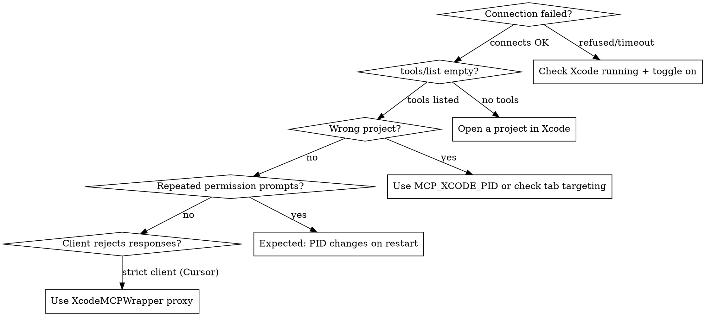

# Xcode MCP Setup

## Prerequisites

- **Xcode 26.3+** with MCP support
- **macOS** with Xcode installed and running
- At least one project/workspace open in Xcode

## Step 1: Enable MCP in Xcode

1. Open Xcode **Settings** (Cmd+,)
2. Go to **Intelligence** tab
3. Check **Enable Model Context Protocol**
4. Ensure **Xcode Tools** toggle is ON

Without this toggle, `xcrun mcpbridge` connects but returns no tools.

## Step 2: Connect Your MCP Client

### Claude Code

```bash
claude mcp add --transport stdio xcode -- xcrun mcpbridge
```

Verify: `claude mcp list` should show `xcode` server.

### Codex

```bash
codex mcp add xcode -- xcrun mcpbridge
```

### Cursor

Create or edit `.cursor/mcp.json` in your project root:

```json
{
  "mcpServers": {
    "xcode": {
      "command": "xcrun",
      "args": ["mcpbridge"]
    }
  }
}
```

**Cursor-specific note**: Cursor is a strict MCP client. Xcode's mcpbridge omits `structuredContent` when tools declare `outputSchema`, which violates the MCP spec. If Cursor rejects responses, use [XcodeMCPWrapper](https://github.com/SoundBlaster/XcodeMCPWrapper) as a proxy:

```json
{
  "mcpServers": {
    "xcode": {
      "command": "/path/to/XcodeMCPWrapper",
      "args": []
    }
  }
}
```

### VS Code + GitHub Copilot

Create or edit `.vscode/mcp.json`:

```json
{
  "servers": {
    "xcode": {
      "type": "stdio",
      "command": "xcrun",
      "args": ["mcpbridge"]
    }
  }
}
```

### Gemini CLI

```bash
gemini mcp add xcode -- xcrun mcpbridge
```

## Step 3: Verify Connection

After configuration, call `XcodeListWindows` (no parameters). You should see:

```
tabIdentifier: <uuid>, workspacePath: /path/to/YourProject.xcodeproj
```

If you see an empty list, ensure a project is open in Xcode.

## Permission Dialog

When an MCP client first connects, Xcode shows a **permission dialog**:

- Identifies the connecting process by **PID**
- Asks to allow MCP tool access
- Must be approved in Xcode's UI (not terminal)

**PID-based approval**: Permission is granted per-process. If the client restarts (new PID), you'll see the dialog again. This is expected behavior.

## Multi-Xcode Targeting

When multiple Xcode instances are running:

### Auto-Detection (default)

mcpbridge auto-selects using this fallback:
1. If exactly one Xcode process is running → uses that
2. If multiple → uses the one matching `xcode-select`
3. If none → exits with error

### Manual PID Selection

Set `MCP_XCODE_PID` to target a specific instance:

```bash
# Find Xcode PIDs
pgrep -x Xcode

# Claude Code with specific PID
claude mcp add --transport stdio xcode -- env MCP_XCODE_PID=12345 xcrun mcpbridge
```

### Session ID (optional)

`MCP_XCODE_SESSION_ID` provides a stable UUID for tool sessions, useful when tracking interactions across reconnections.

## Troubleshooting



### Common Issues

| Symptom | Cause | Fix |
|---------|-------|-----|
| "Connection refused" | Xcode not running or MCP toggle off | Launch Xcode, enable MCP in Settings > Intelligence |
| tools/list returns empty | No project open, or permission not granted | Open a project, check for permission dialog in Xcode |
| Tools target wrong project | Multiple Xcode windows, wrong tab | Call `XcodeListWindows`, use correct `tabIdentifier` |
| Repeated permission prompts | Client restarted (new PID) | Expected behavior — approve each time |
| Cursor/strict client errors | Missing `structuredContent` in response | Use XcodeMCPWrapper as proxy |
| "No such command: mcpbridge" | Xcode < 26.3 | Update to Xcode 26.3+ |
| Slow/hanging tool calls | Large project indexing | Wait for Xcode indexing to complete |

### Xcode Built-in Assistant Config

Xcode also supports MCP servers for its built-in assistants. Config files live at:

```
~/Library/Developer/Xcode/CodingAssistant/codex
~/Library/Developer/Xcode/CodingAssistant/ClaudeAgentConfig
```

These are for configuring Xcode's **internal** assistant, separate from external MCP client setup.

## Resources

**Docs**: /xcode/mcp-server

**Skills**: axiom-xcode-mcp-tools, axiom-xcode-mcp-ref
