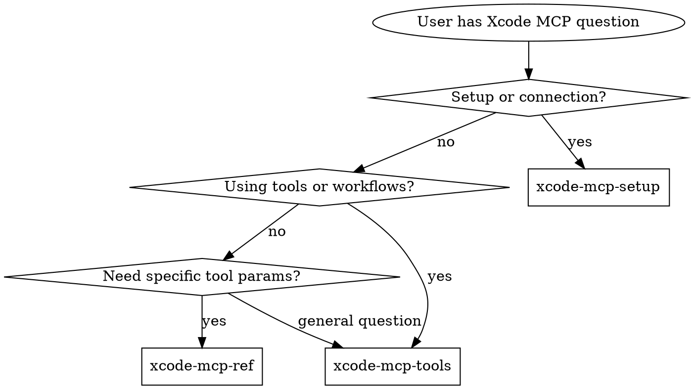

# Xcode MCP Router

**You MUST use this skill for ANY Xcode MCP interaction — setup, tool usage, workflow patterns, or troubleshooting.**

Xcode 26.3 ships an MCP server (`xcrun mcpbridge`) that exposes 20 IDE tools to external AI clients. This router directs you to the right specialized skill.

## When to Use

Use this router when:
- Setting up Xcode MCP for the first time
- Configuring `xcrun mcpbridge` for any MCP client
- Using any Xcode MCP tool (file ops, build, test, preview)
- Building, testing, or previewing via MCP tools
- Troubleshooting mcpbridge connection issues
- Window/tab targeting questions
- Permission dialog confusion

## Routing Logic

### 1. Setup/Connection → **xcode-mcp-setup**

**Triggers**:
- First-time Xcode MCP setup
- Client-specific config (Claude Code, Cursor, Codex, VS Code, Gemini CLI)
- Connection errors ("Connection refused", "No windows")
- Permission dialog confusion
- Multi-Xcode targeting (`MCP_XCODE_PID`)
- Schema compliance issues with strict clients

**Invoke**: `$axiom-xcode-mcp-setup`

---

### 2. Using Tools & Workflows → **xcode-mcp-tools**

**Triggers**:
- How to build/test/preview via MCP
- Workflow patterns (BuildFix loop, TestFix loop)
- Tool gotchas and anti-patterns
- Window/tab targeting strategy
- When to use MCP tools vs CLI (`xcodebuild`)
- Destructive operation safety (`XcodeRM`, `XcodeMV`)

**Invoke**: `$axiom-xcode-mcp-tools`

---

### 3. Tool API Reference → **xcode-mcp-ref**

**Triggers**:
- Specific tool parameters and schemas
- Input/output format for a tool
- "How does XcodeGrep work?"
- "What params does BuildProject take?"
- Tool category listing

**Invoke**: `$axiom-xcode-mcp-ref`

---

## Decision Tree

## Anti-Rationalization

| Thought | Reality |
|---------|---------|
| "I'll just use xcodebuild directly" | MCP gives IDE state, diagnostics, previews, and navigator issues that CLI doesn't expose |
| "I already know how to set up MCP" | Client configs differ. Permission dialog behavior is specific. Check setup skill. |
| "I can figure out the tool params" | Tool schemas have required fields and gotchas. Check ref skill. |
| "Tab identifiers are obvious" | Most tools fail silently without correct tabIdentifier. Tools skill explains targeting. |
| "This is just file reading, I'll use Read tool" | XcodeRead sees Xcode's project view including generated files and resolved packages |

## Conflict Resolution (vs Other Routers)

| Domain | Owner | Why |
|--------|-------|-----|
| MCP-specific interaction (mcpbridge, MCP tools, tab identifiers) | **xcode-mcp** | MCP protocol and tool-specific |
| Xcode environment (Derived Data, zombie processes, simulators) | **ios-build** | Environment diagnostics, not MCP |
| Apple's bundled documentation (for-LLM guides/diagnostics) | **apple-docs** | Bundled docs, not MCP tool |
| `DocumentationSearch` MCP tool usage specifically | **xcode-mcp** | MCP tool invocation |
| Build failures diagnosed via CLI | **ios-build** | Traditional build debugging |
| Build failures diagnosed via MCP tools | **xcode-mcp** | MCP workflow patterns |

## Example Invocations

User: "How do I set up Xcode MCP with Claude Code?"
-> Invoke: `$axiom-xcode-mcp-setup`

User: "How do I build my project using MCP tools?"
-> Invoke: `$axiom-xcode-mcp-tools`

User: "What parameters does BuildProject take?"
-> Invoke: `$axiom-xcode-mcp-ref`

User: "My mcpbridge connection keeps failing"
-> Invoke: `$axiom-xcode-mcp-setup`

User: "How do I target a specific Xcode window?"
-> Invoke: `$axiom-xcode-mcp-tools`

User: "Can I render SwiftUI previews via MCP?"
-> Invoke: `$axiom-xcode-mcp-tools` (workflow), then `$axiom-xcode-mcp-ref` (params)

User: "Cursor can't parse Xcode's MCP responses"
-> Invoke: `$axiom-xcode-mcp-setup` (schema compliance section)

## Resources

**Skills**: xcode-mcp-setup, xcode-mcp-tools, xcode-mcp-ref
